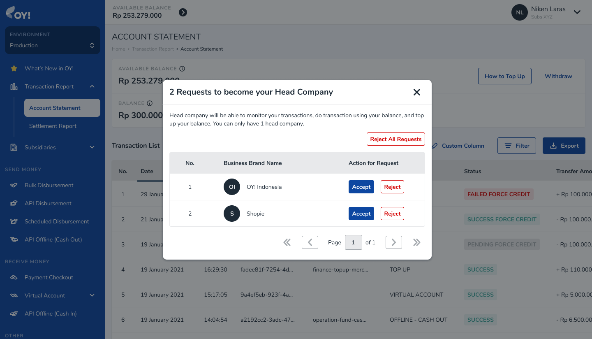
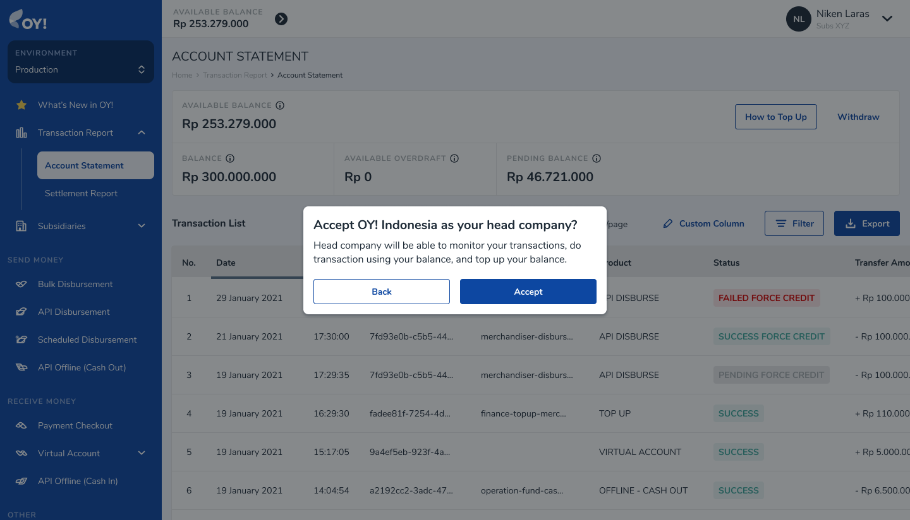
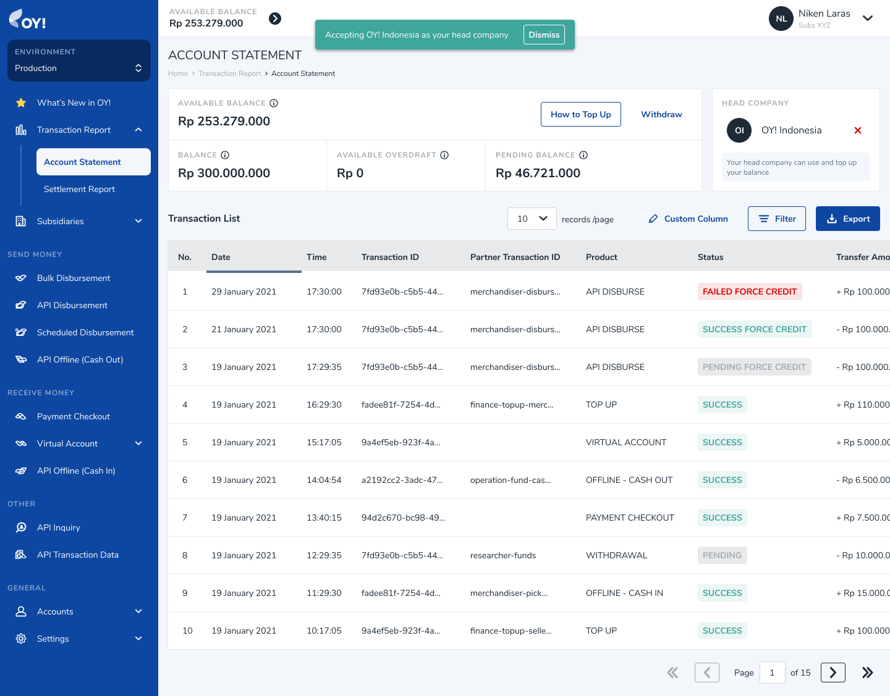
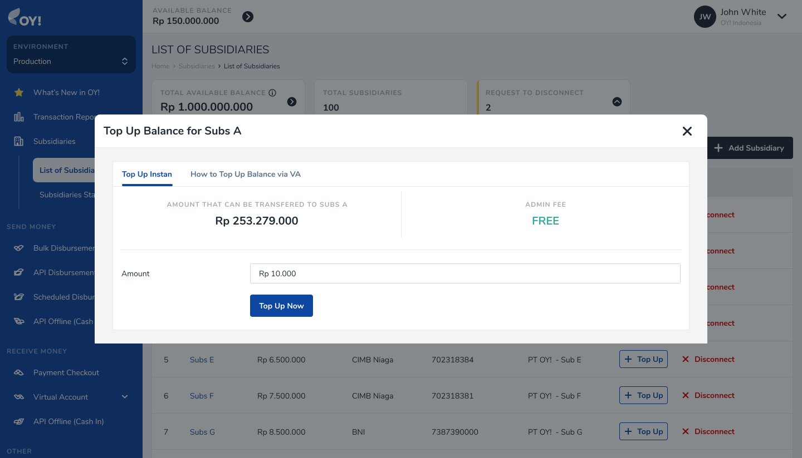
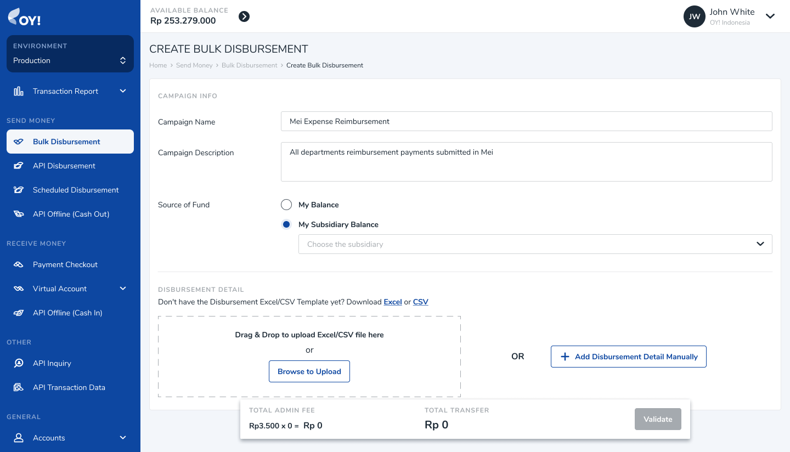

# OY! Dashboard Tutorial

## Login

To be able to login to Dashboard;
1. Make sure the username and password that you input are correct
2. Click 'Request OTP' button and input the OTP in the PIN Authentication field. The OTP will be sent to the email associated with your username.

If you tick the 'Remember this device' option, you are not required to input an OTP when you log back in next time. Hence, point 2 is required only when you login for the first time after you create your account.

## User Management

If you have a Super Admin role, you are able to add account for your team members and define the role for them.

These are the following steps to add new users;
1.  Login to Dashboard
2.  Go to Accounts -> User Management

3.  Click the 'Create User' button 
4.  Fill in the full name, username, email, phone number (optional), and password

5.  Choose the role that you want to assign your team member(s) to. You can choose one from the following available role:

- Admin: Has access to all menu, create and approve bulk disbursement and request, view active feature report, manage user list.
- Sub Account (Approver): Has access to approve disbursement and request, and view active feature report.
- Sub Account (Maker): Has access to create disbursement and request, and view active feature report

Aside from adding new users, a Super Admin is also able to edit and delete their existing users through clicking edit/delete button on the User List table.

## 2-Factor Authentication

To increase the security of your account, you can set up 2-factor Authentication. Currently, the security method that OY provides is through an authenticator app

These are the following steps to set up the 2-factor authentication;
1. Login to Dashboard
2. Go to Accounts -> Authenticator OTP
3. Download Authenticator App in your smartphone (from Play Store/App Store) or PC (you can download an extension for your browser). Examples of the app: Google Authenticator, Microsoft Authenticator, Authy, etc
4. Scan the barcode displayed on your OY Dashboard with your Authenticator App OR enter the setup key displayed next to it on your Authenticator App
5. Please type in the 6-numerical code displayed on your Authenticator App in the 'Authenticator OTP' on OY Dashboard

## Top Up

Top up is used to add balance to your OY account. 

Here's how you can access the top-up menu on your dashboard;  
1.  Login to Dashboard. 
2.  Go to Transaction Report -> Account Statement. 
3.  Click the 'How To Top Up' button. 

There are 2 ways in which you can top up your OY account:
- Top Up via Virtual Account
The Virtual Account number information can be found on 'How to Top Up Balance via VA' tab once you click the 'How To Top Up' button. If you choose to top up via VA, the topped up amount will be credited into your account real-time and you do not need to send any manual confirmation to OY 

 
- Manual Top Up via Bank Transfer
Aside from Virtual Account, you can also transfer the top up money to OY's giro account. If you choose to top up via this method, you need to perform a manual confirmation in order that your money can be credited into your account.

After you have completed the fund transfer to OY! Indonesia, you need to perform the following steps;

1. Click the 'Manual Top Up Confirmation' tab on the top-up menu

2. Fill in the fields with the following information;

Field Name | Description|
------ | ----------- | 
Amount | The amount that you have topped up (as per written in the Bukti Transfer)
Beneficiary Bank| A dropdown where you can choose to which bank you have transferred the top up amount to
Transfer Receipt| Click the upload button to upload the Bukti Transfer obtained after you have successfully performed the transfer. Can be in PDF, PNG, or JPEG format, with max. file size 10 MB
Transfer Receipt Type| Transfer Receipt with Reference Number --> If your uploaded transfer receipt displays the reference number, you need to choose this option.     Transfer Receipt without Reference Number --> If your uploaded transfer receipt doesn't display the reference number, you need to choose this option and fill in the date & timestamp according to your Bukti Transfer.

3. Click 'Submit Now'
4. You will receive a receipt of your transaction in your email, stating that your transaction is currently being processed

5. You will receive an email confirming whether your top up is success or failed

## Withdrawal

When you want to withdraw, do the following steps:

1.  Go to Transaction Report -> Account Statement
2.  Click Withdraw
3.  Fill in the amount that you want to withdraw

4.  Choose your withdrawal type. You can pick one from the following options:

	- Instant with admin fee -> This means that your withdrawal will be processed and arrive into your receiving bank real-time. If the amount to be withdrawn is <= IDR 50 million and the receiving banks are BCA, BRI, BNI, Mandiri, Permata, DBS and CIMB Niaga, you can choose this option. You will be charged an admin fee if you choose this option
	
	- Manual -> This means that your withdrawal will be processed up to 2 business days. If the amount to be withdrawn is > IDR 50 million OR the receiving banks are not BCA, BRI, BNI, Mandiri, Permata, DBS or CIMB Niaga, you have to choose this option. You will NOT be charged an admin fee if you choose this option.

### Setting Up Auto Withdrawal Process

If you want to set up an **Auto Withdrawal** periodically, go to Settings -> Auto Withdrawal.

Here's how you can configure the auto withdrawal settings;

Field Name | Description|
------ | ----------- | 
Auto Withdrawal Schedule | The schedule of your auto withdrawal. Options available: Daily, Weekly, Bi-Weekly, Monthly
Start Date | Start date of your auto withdrawal schedule
Ends| Options available: Never -> if the auto withdrawal will go on for an indefinite time, By Date -> if the auto withdrawal will end on a specific date. If you choose this option, you need to fill in the date on which you plan to end the auto withdrawal process
Amount | Amount to be automatically withdrawn. Options available: Maximum amount -> Withdraw the maximum available balance, Specified Amount -> custom specified amount. Note: Maximum Amount is recommended for Auto Withdrawal transactions as withdrawals will not be processed if the specified amount is greater than the OY balance when the withdraw scheduler runs
Withdrawal Type | Options available: 1) Instant, or 2) Manual. 
Email | An email we will send the notification to. Use (;) between email to differentiate them (Max. 5 emails can be inputted)

## Transaction Report - Settlement Report

Settlement Report stores the list of transactions corresponding to payment methods that are not settled on a real-time basis (delayed settlement). For example, if for VA BCA the settlement time is H+2, each new VA BCA transaction performed by your customers will appear on the Settlement Report.

To access the Settlement report;
- Login to Dashboard
- Go to Transaction Report -> Settlement Report

The Settlement Report consists of the following information;

- Total Amount to be Settled Today: This tells you the sum of amount scheduled to be settled to your account statement balance today
- Total Delayed Settlement Amount: This tells you the sum of amount not yet settled to your account statement. (the settlement status is still not SUCCESS)
- The Settlement Transaction List Table

Field Name | Description | Example
------ | ----------- | -----------
Transaction Date | The date on which your customer performs the transaction| 11 May 2021
Transaction Time | The time at which your customer performs the transaction| 17:44:09
Transaction ID | A unique transaction ID given by OY |   d4b26687-34b9-43d3-9d08-af440bcbaca7
Partner Transaction ID | A unique transaction ID that is assigned by you for a given transaction | TXID_001
Product | The product associated with a given transaction. This will be filled with VIRTUAL_ACCOUNT if the transaction comes from Virtual Account Aggregator product, or PAYMENT_CHECKOUT if the transaction comes from Payment Checkout product | VIRTUAL_ACCOUNT
Payment Method | The payment method associated with a given transaction. Possible values: VA [Bank Name], CARDS, QRIS, EWALLET SHOPEEPAY| VA BCA
Transfer Amount| The transaction amount (before getting deducted with admin fee | +Rp 10.000
Admin Fee| The admin fee associated with a given transaction | -Rp 1.000 
Total Amount| The transaction amount that has been deducted with admin fee | +9,000 
Settlement Date| The scheduled settlement date for a given transaction | 12 May 2021 
Settlement Time| The scheduled settlement timestamp for a given transaction | 15:00:00
Settlement Status| The settlement status for a given transaction. Possible values: WAITING (if the amount is not yet settled to your account statement balance), SUCCESS (if the amount has been settled to your account statement balance). | SUCCESS

If the Settlement Status of a transaction is still WAITING, it will not yet appear as a row in your Account Statement report and the amount will not yet be added in your Account Statement balance.

If the Settlement Status of a transaction is already SUCCESS, it will appear as a row in your Account Statement report and the amount will be added in your Account Statement balance.

### Callback for Delayed Settlement (Non-Real Time Settlement)

If your settlement is non-real time, for every transaction whose payment method is settled H+>0, you will receive two callbacks with details as follows:

1. 1st Callback -> To be sent after your customer successfully executes the transaction. For example, if your customer executes the transaction on 11 May 2021 at 14:00:00, that is also when we send the 1st Callback to you. In the 1st callback, the settlement status is set to WAITING (because it is not yet settled to your Account Statement balance)
2. 2nd Callback -> To be sent after the settlement status is changed from WAITING into SUCCESS. For example, if the settlement status is changed into SUCCESS on 12 May 2021 at 15:00:00, that is also when we send the 2nd Callback to you. In the 2nd callback, the settlement status is SUCCESS

### Capability to Export and Filter the Settlement Report

Export: You are able to export/download the settlement report in CSV, PDF, and XLSX.

Filter: You are able to filter the settlement report by transaction date (range), product, payment method, settlement date (range), and settlement status

## Notification

You can enable or disable notification settings for disbursement products if you have a super admin or admin role: 
1. Login to dashboard https://business.oyindonesia.com/
2. Go to Settings -> Notification 

1. Choose whether or not you want notifications enabled or disabled for Bulk, API, or scheduled disbursements.	
   a. Enable Notification: Email notification will be sent for pending, failed and success transactions. 
   b. Disable Success Notification: email notification will only be sent for pending and failed transactions.
2. The email field:  allows the user to add, remove, and edit email notification receivers in this column, which can hold up to three email addresses.
3. Click ‘Save Changes’

## Multi Account Management

Multi Account Management (Subsidiaries) is a feature that can help you handle complex relations between entities in your business in the Oy! Dashboard. Please contact our Sales or Account Management if you’re interested to use this feature.  
With this feature you will be able to :

1. Have a detailed report on transactions performed by all of subsidiary account
2. Distribute balance between the parent account to subsidiaries account
3. Use subsidiary balance to disburse funds
4. free admin fee to disburse between related user

### **Registration & Setup**

**Prerequisites**

Register an account on the [OY! dashboard](https://business.oyindonesia.com/register?)
Activate your account through the activation link sent via email
Upgrade your account
Upgrade request is approved
Contact our sales or account manager representatives to enable the feature

### **How To Use**

To properly used Multi Account Management, we required several accounts to be linked together. Each account can be used independently, and each account needs to pass the KYB to be used fully.

**A. Link to Subsidiary Account**

1. **For Parent Account**

To add a new subsidiary as a parent account please 1) Log in to Dashboard with parent credential 2) Go to Subsidiaries → List of Subsidiaries

.png)

1. Click the “+ Add Subsidiary”
2. Fill in the username for the subsidiary you wished to connect. You can find your username from the menu Accounts → User Profile in the Username section
3. Click Add and then if the account is found in the system you can confirm by clicking Connect in the confirmation window

 
After confirming, the request will be sent to the respective account to be accepted

1. **For Subsidiary Account**

To receive a request from a parent company, please 1) Log in to dashboard with subsidiary credential 2) Go to Transaction Report → Account Statement

1. Click the “Check All request” button that can be found near the top right corner of the page
2. You will see the incoming request to be the parent account for your account, then you can choose which account is the correct account for the parent by click Accept in the respective account and confirmation window

1. After successfully received the parent request to connect, you will find your parent information near the top right corner of your page, and you are now connected as a parent-subsidiary account

**B. Topup money to a subsidiary account**

After having a working parent-subsidiary account, you can transfer money to the subsidiary account by accessing the menu Subsidiaries → List of Subsidiaries

1. Find the account that you wished to top-up
2. Click the “+ Top Up” button
3. Fill in the amount you wish to top-up
4. Click the “Top Up Now” button to proceed
5. You can also do Top Up by transfer to one of the VA provided (see “How to Top Up Balance via VA”

**C. Disburse Money using subsidiary balance**

In Multi Account Management, you will be able to do disbursement using your subsidiary account on their behalf. To do this you could

1. Access the Bulk Disbursement menu and clicking on “+ Create Disbursement” button
2. Select your subsidiary balance as a source of fund to do disbursement by selecting “My Subsdiary Balance” and choose the appropriate account.
3. After choosing the balance you could proceed to do disbursement just like regular disbursement

 
