# Sending Payments

## API Disbursement

API disbursement product provides the capability for you to disburse to 100+ banks in Indonesia via OY! at any time. The integration process to use the API disbursement product is straight forward and the details can be checked [here](https://api-docs.oyindonesia.com/#fund-disbursement).  

### Key Features

**Overbooking**
OY! can use the funds directly from your Mandiri or CIMB bank accounts for your disbursement needs. You will only need to top up the admin fee needed to execute the disbursements instead of the full amount of your disbursement. Please contact our [business representative](partner@oyindonesia.com) for further details about this feature.
**Check Transaction Status and Callback**

For all disbursements executed, you will receive notifications regarding your transaction whether it is successful, failed or pending. We also provide an API for you to check the transaction status manually. IP proxy is also available upon request to enhance the security and integrity of the callback you will receive. 

**Check Balance**

You can check your available balance at anytime to ensure that you have sufficient balance to execute a disbursement.

### Registration and Set Up
**Prerequisites** 

* Register an account on the [OY! dashboard](https://business.oyindonesia.com/register?)

* Activate your account through the activation link sent via email

* Upgrade your account 

* Upgrade request is approved

* Provide IP to be whitelisted and callback link to our business team

* Receive an API Key from us

* Integrate with our [API](https://api-docs.oyindonesia.com/#fund-disbursement)

### Testing

Once you successfully create an OY! account, you can immediately simulate disbursement via API.
Follow the below steps to test the flow:

1. Create an account
2. Login into the dashboard 
3. Change the environment to “staging” 
4. Once the environment changed to staging, there will be API key staging available on the bottom left corner of the page
5. Before creating a disbursement transaction, check your available balance through API GET https://api-stg.oyindonesia.com/api/balance
6. Create a disbursement by sending a ‘POST’ request to _https://api-stg.oyindonesia.com/api/remit_ (https://api-stg.oyindonesia.com/api/remit) using your staging API key. Enter the required and optional fields, as referenced in the API reference docs (https://api-docs.oyindonesia.com/#disbursement-fund-disbursement)
7. Fill in the amount, recipient bank, recipient account, and the partner transaction-id
8. To get the status of a disbursement request, you can call the API https://api-stg.oyindonesia.com/api/remit-status,  This API also offers the option for callback status under field  send_callback
9. If payment is successful or failed, we will send a callback to the registered staging callback URL destination. Callback URL can be registered via our business representative.
10. The API disbursement transactions can be monitored through OY! dashboard from the “Send money - API disbursement” menu.


### How to Use 

In order to create disbursements, a sufficient available OY! balance is required in the account. More details and instructions about topping up to your OY! account coming soon.

Before you execute a disbursement, you can verify the beneficiary account information from our [inquiry endpoint](https://api-docs.oyindonesia.com/#bank-account-inquiry). 

> Below is an example of the request body for inquiry:

```shell 
curl -X POST https://partner.oyindonesia.com/api/inquiry 
-H 'content-type: application/json, accept: application/json, x-oy-username:myuser, x-api-key:987654' 
-d '{
    "recipient_bank": "022", 
    "recipient_account": "7823023345"
    }'
```

> It will return an [error message](https://api-docs.oyindonesia.com/#fund-disbursement-response-codes) if the request is not valid. Otherwise, below is the sample response parameters that will be returned:

```json
{
    "status":{
        "code":"000",
        "message":"Success"
    },
    "recipient_bank":"022",
    "recipient_account":"7823023345",
    "recipient_name":"Budi Budianto Budiman",
    "timestamp":"16-10-2021 09:55:31"
}
```

> 

Next, send a request body to execute a disbursement request to be sent to our [disbursement endpoint](https://api-docs.oyindonesia.com/#disbursement). 

> Below is an example of the request body for the remit: 

```shell
curl -X POST https://partner.oyindonesia.com/api/remit 
-H 'content-type: application/json, accept: application/json, x-oy-username:myuser, x-api-key:7654321' 
-d '{
    "recipient_bank": "022", 
    "recipient_account": "7823023345", 
    "amount":100000, "note":"Pembayaran Nov IV", 
    "partner_trx_id":"Tx15048563JKFJ", 
    "email" :"budi.s@gmail.com"
    }'
```

> Below is the sample response parameters that will be returned:

```json 
{
    "status":{
        "code":"101",
        "message":"Request is Processed"
    },
    "amount":100000,
    "recipient_bank":"022",
    "recipient_account":"7823023345",
    "trx_id":"89718ca8-4db6-40a0-a138-a9e30d82c67d",
    "partner_trx_id":"Tx15048563JKFJ",
    "timestamp":"16-10-2019 10:23:42"
}
```

> 

An enpoint to [check the transaction](https://api-docs.oyindonesia.com/#get-disbursement-status) is also available and can be accessed at anytime. 

> Below is an example of the request body: 

```shell
curl -X POST https://partner.oyindonesia.com/api/remit-status 
-H 'content-type: application/json, accept: application/json, x-oy-username:myuser, x-api-key:7654321' 
-d '{
    "partner_trx_id": "1234-asde", 
    "send_callback": "true"
    }'
```

> The above command returns a JSON structured similar like this:

```json
{
  "status":{
    "code":"000",
    "message":"Success"
  },
  "amount":125000,
  "recipient_name":"John Doe",
  "recipient_bank":"008",
  "recipient_account":"1234567890",
  "trx_id":"ABC-456",
  "partner_trx_id":"1234-asde",
  "timestamp":"16-10-2020 10:34:23",
  "created_date": "24-01-2020 06:48:08",
  "last_updated_date": "24-01-2020 06:48:39"
}
```

>

A callback with the following information will be sent to the callback endpoint that you can register with us. 

> Below is an example of the request body: 

```shell 
curl -X POST https://partner.oyindonesia.com/api/remit-status 
-H 'content-type: application/json, accept: application/json, x-oy-username:myuser, x-api-key:7654321' 
-d '{
    "partner_trx_id": "Tx15048563JKFJ"
    }'
```

> Below is the sample response parameters that will be returned:

```json
{
    "status":{
        "code":"000",
        "message":"Success"
    },
    "amount":100000,
    "recipient_name":"Budi Soemitra Nasution",
    "recipient_bank":"022",
    "recipient_account":"7823023345",
    "trx_id":"89718ca8-4db6-40a0-a138-a9e30d82c67d",
    "partner_trx_id":"Tx15048563JKFJ",
    "timestamp":"16-10-2019 10:40:23",
    "created_date": "16-10-2019 10:23:42",
    "last_updated_date": "16-10-2019 10:34:23"
}
```

>

You can also [check your balance](https://api-docs.oyindonesia.com/#get-balance) anytime to ensure you have sufficient balance from our endpoint.

> Below is an example of a request body to check the balance:

```shell
curl -X GET 'https://partner.oyindonesia.com/api/balance' 
-H 'Content-Type: application/json' 
-H 'Accept: application/json' 
-H 'X-OY-Username: janedoe' 
-H 'X-Api-Key: 7654321'
```

> Below is the sample response parameters that will be returned:

```json 
{
    "status":{
        "code":"000",
        "message":"Success"
    },
    "balance":100000000.0000,
    "pendingBalance":2000000.0000,
    "availableBalance":98500000.0000,
    "overbookingBalance":98500000.0000,
    "timestamp":"10-12-2019 12:15:37"
}
```

>

Lastly, all transactions can be monitored from the OY! dashboard which includes all the transaction details.


For further details on the parameters definition and proper usage, please refer to our [API Documentation](https://api-docs.oyindonesia.com/#fund-disbursement).


## Bulk Disbursement

Our Bulk disbursement product provides the capability to execute disbursements to multiple beneficiaries with a single xlsx or csv file upload ("Campaign") up to 25,000 transactions. Bulk disbursement is made through the OY! dashboard, where details regarding the disbursement campaign can be found. No technical integration is required to use this product.

### Key Features 

**Overbooking**
OY! can use the funds directly from your Mandiri or CIMB bank accounts for your disbursement needs. You will only need to top up the admin fee needed to execute the disbursements instead of the full amount of your disbursement. Please contact our [business representative](partner@oyindonesia.com) for further details about this feature.

**Account Management** 

When you first create an account, your account will be assigned as a Super Admin role. As a Super Admin, you have the ability to create new sub-accounts and assign different roles to your team such as Admin, Maker and Approver that are applicable for bulk disbursement. The Super Admin and Admin can also edit or delete created sub-accounts. 

*Note: it is not necessary to create new sub-accounts in order to use bulk disbursement. The Super Admin and Admin roles allows you to directly create and approve bulk disbursements.*

Detailed step-by-step instructions on setting up user management and the different role types coming soon. 

**Multi-Layer Approval** 

Multi-layer Approval will improve your control over your bulk disburse transaction especially for big amount of money. You can setup up to 3 layers of approver before the transaction instruction is executed. By assigning proper approver and amount limitation, you can avoid a huge trouble on your business operational caused by incorrect transfer amount.

**Overall Campaign Summary**

Keep track of all the details of the entire campaign such as the total amount of disbursement, total number of transactions, and the maker and approver related information of a campaign.

**Transaction Details**

Itemized details of each individual transaction, including their respective statuses: success, pending, or failed.

### Registration and Set Up 
**Prerequisites**

* Register an account on the [OY! dashboard](https://business.oyindonesia.com/register?)

* Activate your account through the activation link sent via email

* Upgrade your account 

* Upgrade request is approved 

### Testing

1. Log on your OY! dashboard
2. Choose "Staging" environment
3. Click "Send Money" menu, and choose "Bulk disbursement"
4. Click "Create Disbursement"
5. Fill in the necessary details by following the steps explained in the “How to Use” section

### How to Use

In order to create disbursement campaigns, a sufficient available OY! balance is required in the account. If there is an insufficient available balance in the account, campaigns can still be created but not approved.

*1. Create Disbursement*: On the OY! dashboard, navigate to Send Payments > Bulk Disburse on your left menu bar. Click “Create Disbursement” on the far righthand side of that page to create a new bulk disbursement campaign.

*2. Create Campaign Details*: Fill in the campaign details with 2 options:


a. upload an xlsx or csv file 

Please upload an xlsx or csv file with each individual transaction’s details of your bulk disbursement campaign. An example template for both file types are available for download on the OY! dashboard. The following list of items are required in your CSV file.

Column | Description | Example
------ | ----------- | -----------
Name | Recipient Name | Budy
Email | Recipient Email (can contain up to 5 emails with a total maximum of 255 characters, incoming transaction notifications will be sent to these emails) | Budi@email.com
Amount | Amount in IDR (only numbers) | 100000
Bank Code | [Destination Bank](https://docs.oyindonesia.com/#disbursement-bank-codes) | 014
Bank Account Number | Recipient Bank Account Number | 12341234
Phone Number | Recipient Phone Number | 62812341234
Notes (Optional) | Transaction Notes | 

 b. add disbursement detail manually. : 
choose ‘add disbursement detail manually’ and fill out a campaign name and campaign description in the provided spaces. These details are strictly used as your tracking information only and will not be shared to the transaction recipients.

c. [Staging only] You can replicate failed status on individual transaction within the campaign by fill in _Bank Account Number_ value with `3000000`. Another value will be processed normally.

*3. Re-verify all the Information and Submit*: Once your xlsx or csv file is uploaded or filled out manually, you can verify all of the information uploaded from the file from the table displayed. If there is any incorrect submission such as invalid entry due to special characters, a red box will appear to highlight the entry that should be corrected. Issues must be resolved before a campaign can be submitted


*4. Validate Name Matching*
After all the issue has been resolved, user able to click submit and there will be popup shown to validate each recipient *name *with their *Bank Account Name* as shown below:


if you choose YES: if there is a name difference, a popup name validation with details of mismatched transactions will be displayed. if the information inputted is invalid, you could edit the information and choose the ‘ validate’ button to revalidate the data, or you could click the ‘ignore mismatch’ button to ignore the name matching validation and to process the disbursement.


If there is no issue with the details uploaded, a validate and submit button will be available at the bottom of the list of transactions, indicating that all information is valid. Click “Submit” to complete creating the bulk disbursement campaign.


*5. Approve/Cancel Campaign**: Once the bulk disbursement campaign is created, a new status of `waiting approval` will appear. Approve the campaign by clicking the “Approve” button. If you want to cancel a campaign, click the “...” button and select “Cancel”.

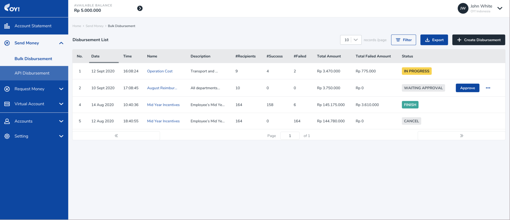

Once the bulk disbursement campaign is approved, details regarding the campaign can no long er be changed. This includes changes made to individual transactions and their respective recipient information. 

The balances will also immediately reflect changes. For more information about the different types of balances, click here. You will also receive an email with the campaign information summary (“Outgoing Transfer Alert”) when transactions are executed.

*Note:* 
- *Depend on the approval layer that you configured, this transaction should be approved by all layer before it can be executed by the system.*
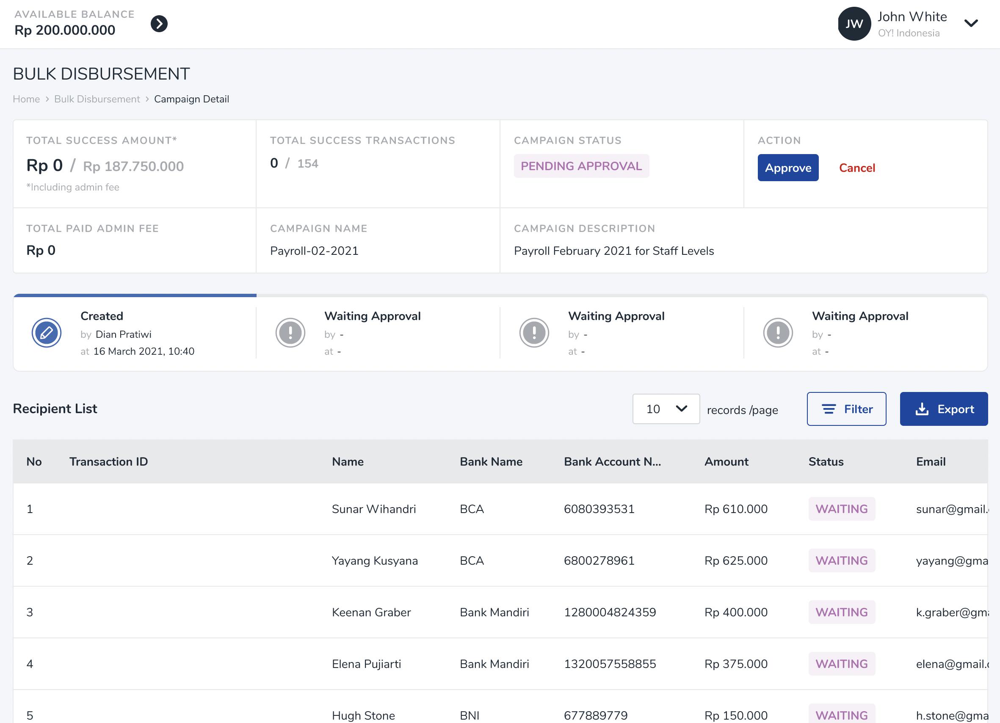

- *Multiple campaigns can be approved at a time as long as there is sufficient available balance to complete campaigns that have already been approved but are still in queue to be processed.*

*6. Keep Track of Campaign Details**: To check the details of the bulk disbursement campaign, click on the campaign name to find the campaign summary and its recipient list. Keep track of the both the overall campaign status and the status of individual transactions through the page. 

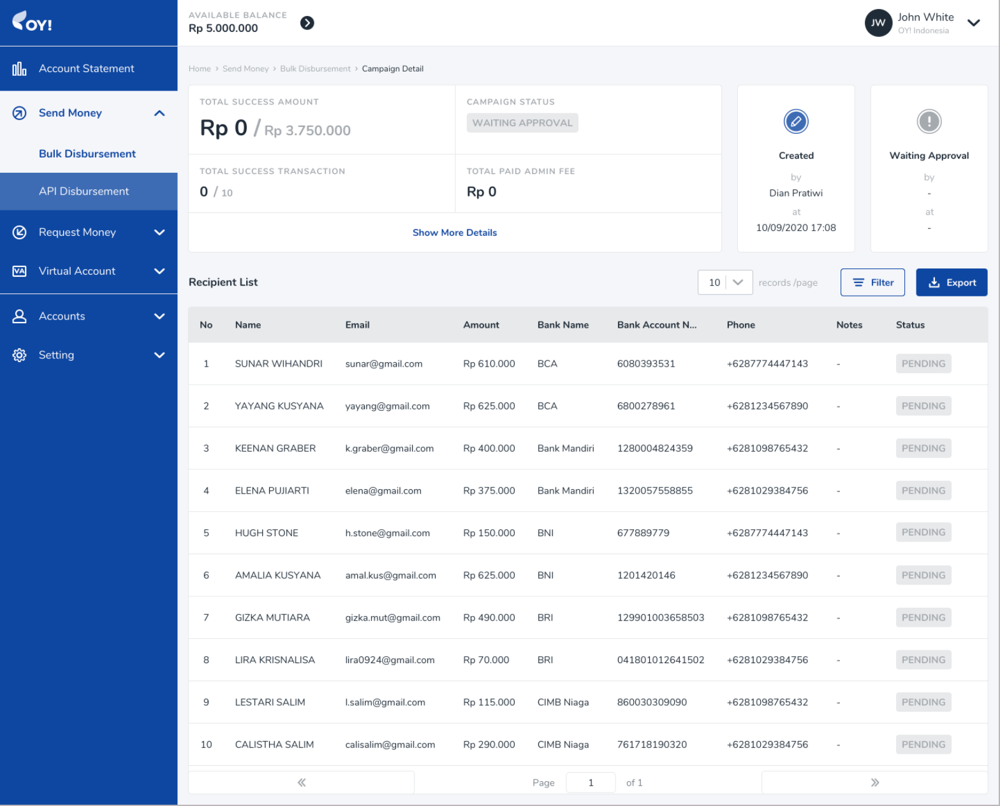

*7. Status: In-Progress, Finish, and Cancel**: Congratulations! You just made your first bulk disbursement with OY! Below are a list of statuses you will find on the OY! dashboard. 

_In-Progress_

As your individual disbursements are executed, the status of your bulk disbursement campaign will indicate an in-progress status. 

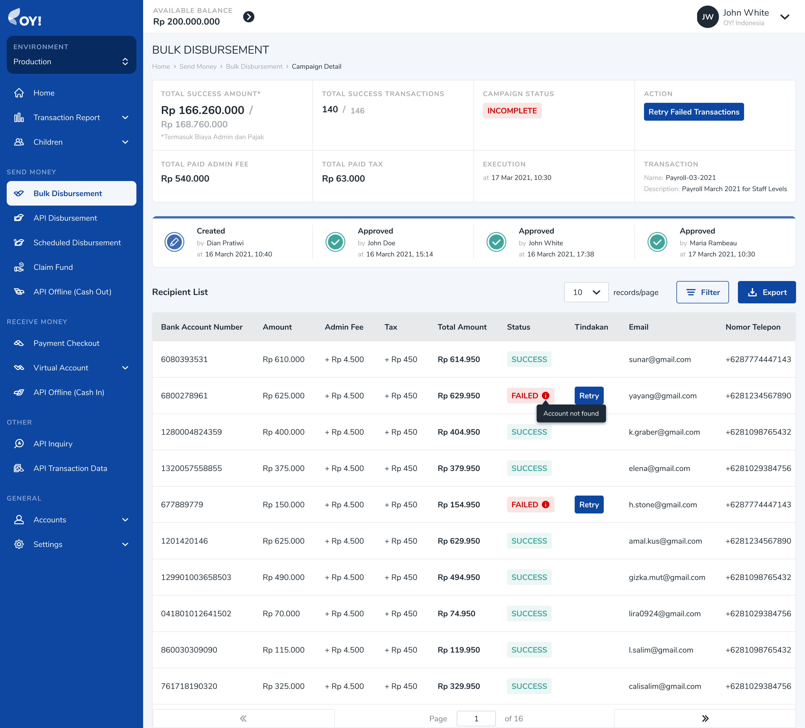

_Incomplete_

The status of your bulk disbursement will change to incomplete once all of the listed transactions have been executed and the relevant final statuses of Failed or partially Failed have been assigned. The failed transactions will be shown the failed reason and can be retried.


_Finish_

Once all of the listed transactions have been completed and the final status of success for all transactions has been achieved, the status of your bulk disbursement campaign will change to Finish.  The recipients should have all received an email detailing an “Incoming Transfer Alert.” You can also download a report of the campaign details directly through the OY! dashboard.


_Cancel_ 

If you choose not to approve your disbursement campaign, the status of your bulk disbursement campaign will indicate a cancelled status. 


You can also double check each of your transactions by navigating to the account statement page on the OY! dashboard. 


## Claim Fund
Claim Fund product enable you to do disbursement without knowing your recipient bank account at first. You will simply create a link for them to fill-out bank account information and the payment will be processed by our system.
This feature will remove you from the hassle of collecting your customer information manually then doing multiple bank transfer.
Best use of this feature is : refunds, reimbursement claim, any disburse transaction in which the destination is not your regular partner.

At the moment, Claim Fund product is available only on OY! Business Dashboard.

### Transaction Flow


### Use Case
1. Refund for purchase transaction 
2. Any money transfer transaction where you don't have recipient bank information

### Registration and Set Up

**Prerequisites** 

* Register an account on the OY! dashboard (https://business.oyindonesia.com/register?)
* Activate your account through the activation link sent via email
* Upgrade your account
* Upgrade request is approved


### Testing
1. Log on your OY! dashboard
2. Choose "Staging" environment
3. Click "Send Money" menu, and choose "Claim Fund"
4. Click "Create Claim Fund"
5. Fill in the necessary details by following the steps explained in the “How to Use” section

### How to Use
In order to execute claim fund transaction successfully, a sufficient available OY! balance is required in the account. However, if there is an insufficient available balance, claim fund transaction can still be created but the approval will failed.

**1. Business Dashboard - Create Claim Fund**

* Create Claim Fund: On the OY! dashboard, navigate to Send Money > Claim Fund on your left menu bar. Click `Create Claim Fund` button on the far righthand side of that page to create a new claim fund transaction.
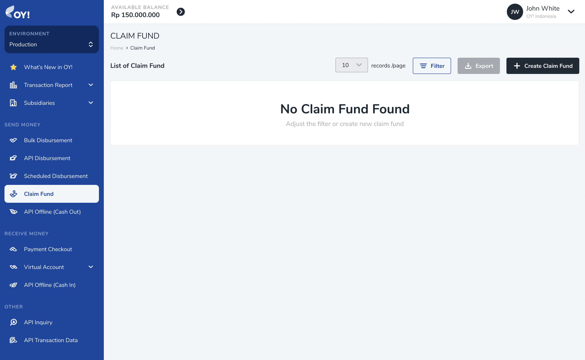
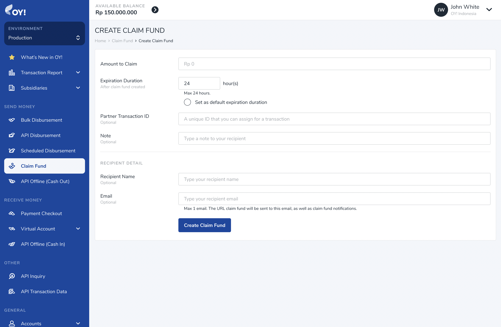

* Please fill-out the information accordingly. Below table is the description of each fields:

| Column                                 | Description                                                                                                                                                           | Example                |
|------------------------------------    |-------------------------------------------------------------------------------------------------------------------------------------------------------------------    |--------------------    |
| Amount to Claim                        | Amount of money to be sent                                                                                                                                            | 1000000                |
| Expiration Duration                    | How long does this claim link be active. After expiration time, customer will not be able to submit their information then new claim fund link has to be created.     | 12 Hours               |
| Set as default expiration duration     | Select this option to make it default expiration time for the next claim fund transaction.                                                                            | -                      |
| Partner Transaction ID                 | Unique identifier for the recipient.                                                                                                                                  | CF00001                |
| Note                                   | additional remarks for recipient                                                                                                                                      | Refund transaction     |
| Recipient Name                         | Recipient Name                                                                                                                                                        | Dwiki Dermawan         |
| Email                                  | Recipient Email                                                                                                                                                       | dwiki@gmail.com        |

* Click `Create Claim Fund` button to submit the transaction. Your recipient will get notified of this claim fund transaction through email. Transaction link will be attached on this email.

* Successful claim fund transaction will be listed on the claim fund transaction listing with INITIATED status.


* Please be noted that this transaction still need account detail to be filled-out by the recipient.

**2. Fund Recipient - Input Account Information**

* On the notification email, user click the `Ajukan Klaim Dana` link to get into claim fund input page. 
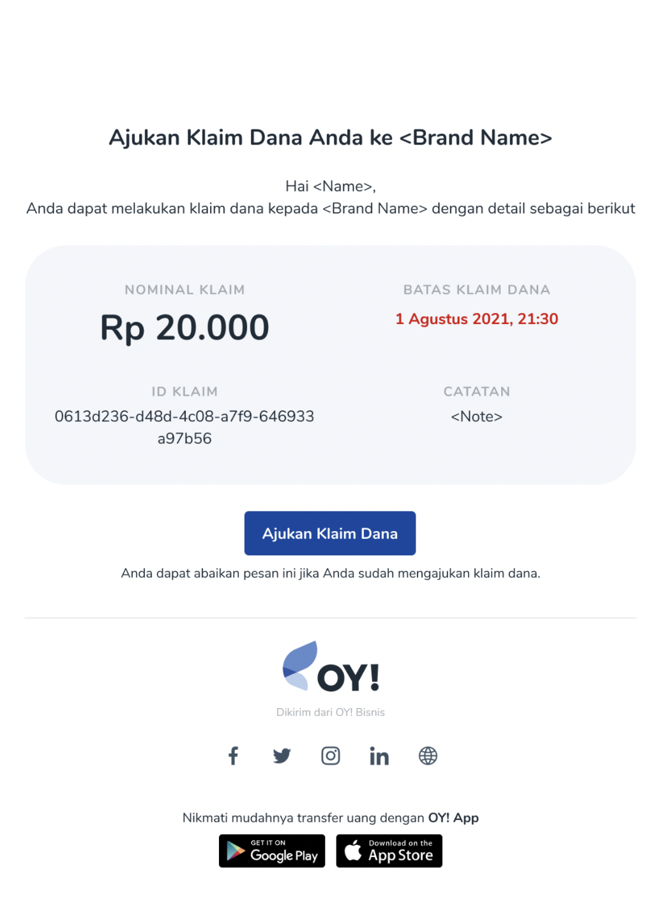

* User should fill-out the detail information so that OY! system can continue with the approval process. 
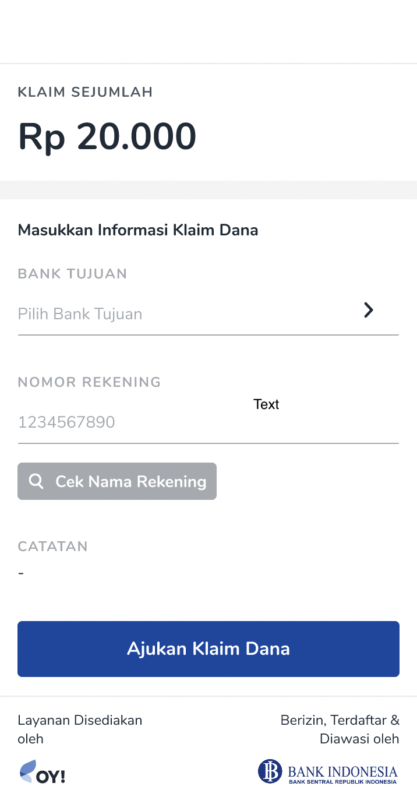
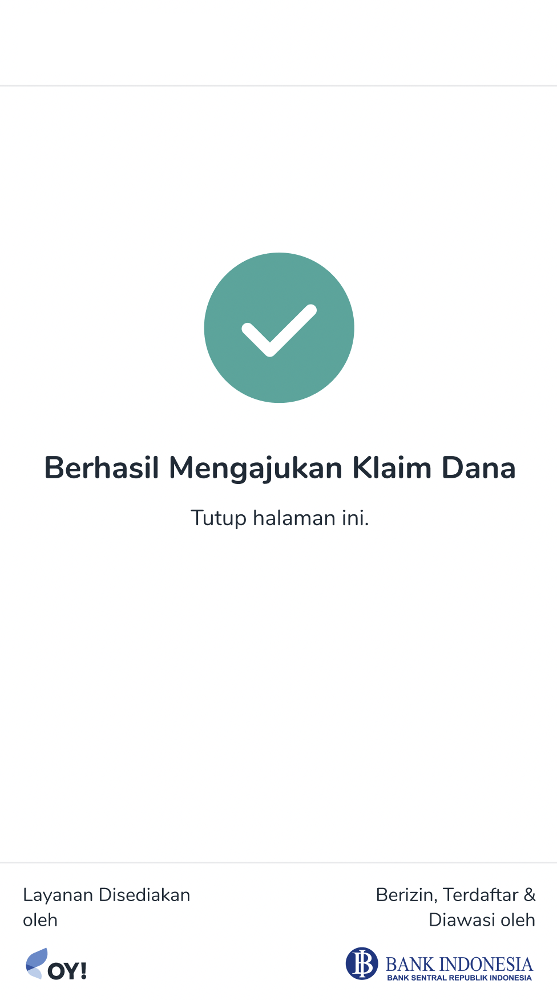

**3. Business Dashboard - Approve Transaction**

Transaction need to go through approval process to ensure that the money will be delivered to correct recipient and sufficient amount is available.

* Approve claim fund transaction: On the OY! dashboard, navigate to Send Money > Claim Fund on your left menu bar. Transactions that already have user detail will be marked with `WAITING APPROVAL` status. 


* You can approve the transaction directly from this screen by clicking Approve button, or go to detail transaction to see more information before approve.


* Click approve button to release the transaction to user.

* The transaction is now marked as `IN PROGRESS`

* Your recipient should get the money delivered to their account immediately.

* In parallel, your customer will also get email notification about successful claim fund transaction.
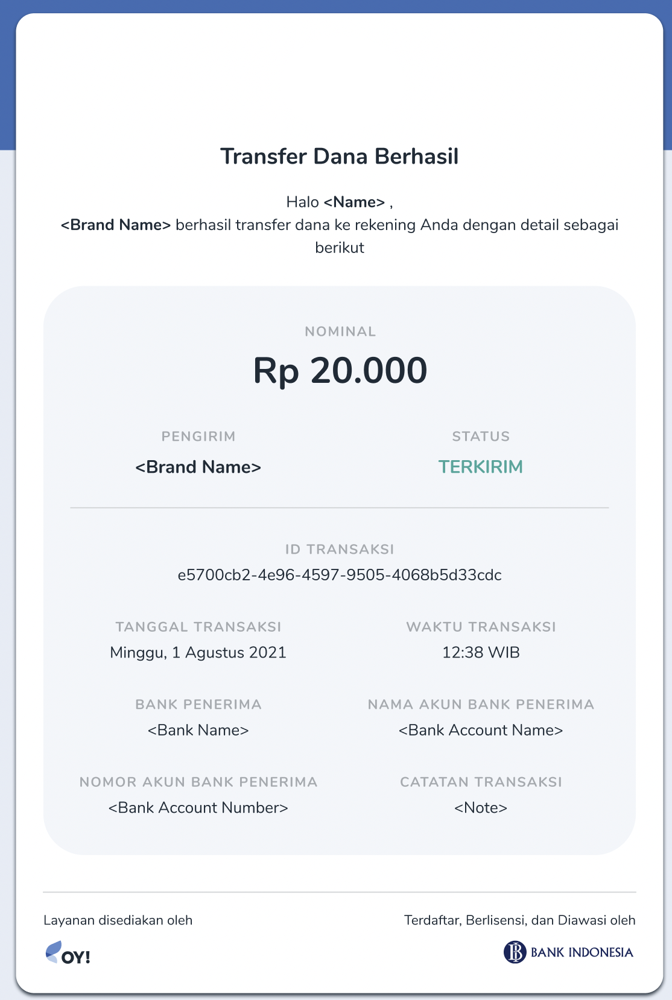

## API Biller

API biller product provides the capability for you to pay the bill products. With 130+ types of billing products, you can provide numerous bill payment options with ease and in real-time.
The integration process to use the API biller product is straight forward and the details can be checked [here](https://api-docs.oyindonesia.com/#biller-api).  

### Transaction Flow

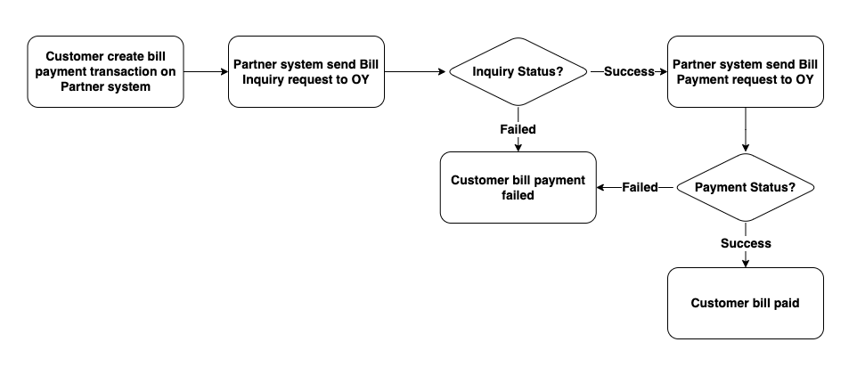

### Key Features

**Overbooking**
OY! can use the funds directly from your Mandiri or CIMB bank accounts for your bill payment needs. Please contact our [business representative](partner@oyindonesia.com) for further details about this feature.

**Check Transaction Status and Callback**

For all bill inquiry & bill payment executed, you will receive notifications regarding your transaction whether it is successful, failed or pending. We also provide an API for you to check the transaction status manually. IP proxy is also available upon request to enhance the security and integrity of the callback you will receive. 

**Check Balance**

You can check your available balance at anytime to ensure that you have sufficient balance to execute a bill payment.

### Registration and Set Up
**Prerequisites** 

* Register an account on the [OY! dashboard](https://business.oyindonesia.com/register?)

* Activate your account through the activation link sent via email

* Upgrade your account 

* Upgrade request is approved

* Provide IP to be whitelisted and callback link to our business team

* Receive an API Key from us

* Integrate with our [API](https://api-docs.oyindonesia.com/#biller-api)

### Testing

Once you successfully create an OY! account, you can immediately simulate bill payment via API.
Follow the below steps to test the flow:

1. Create an account
2. Login into the dashboard 
3. Change the environment to “demo” 
4. Once the environment changed to demo, there will be API key demo available on the bottom left corner of the page
5. Before creating a bill payment transaction, check your available balance through API GET _https://api-stg.oyindonesia.com/api/balance_
6. Request inquiry for the bill you want to pay by sending a ‘POST’ request to _https://api-stg.oyindonesia.com/api/v2/bill_ using your staging API key. Enter the required and optional fields, as referenced in the API reference docs (https://api-docs.oyindonesia.com/#bill-inquiry-biller-api)
7. Fill in the customer-id, product-id, and the partner transaction-id. You will get the detail information about the bill that you want to pay. 
8. After successful inquiry, you should do the payment process by sending a ‘POST’ request to _https://api-stg.oyindonesia.com/api/v2/bill/payment_. Enter the required and optional fields, as referenced in the API reference docs (https://api-docs.oyindonesia.com/#pay-bill-biller-api)
8. To get the status of a bill payment request, you can call the API https://api-stg.oyindonesia.com/api/v2/bill/status
9. If payment is successful or failed, we will send a callback to the registered staging callback URL destination. Callback URL can be registered via our business representative.
10. The API biller transactions can be monitored through OY! dashboard from the “Send money - API biller" menu.


### How to Use 

In order to create API biller transaction, a sufficient available OY! balance is required in the account. More details and instructions about topping up to your OY! account can you see here https://docs.oyindonesia.com/#top-up-oy-dashboard-tutorial.

Before you execute the bill payment, you have to verify the bill information from our [bill inquiry endpoint](https://api-docs.oyindonesia.com/#bill-inquiry-biller-api). 

> Below is an example of the request body for inquiry:

```shell 
curl -X POST https://partner.oyindonesia.com/api/v2/bill 
-H 'content-type: application/json, accept: application/json, x-oy-username:myuser, x-api-key:987654' 
-d '{
    "customer_id": "512233308943",
    "product_id": "plnpost",
    "partner_tx_id": "Tx15048563JKFJ"
    }'
```

> It will return an [error message](https://api-docs.oyindonesia.com/#api-biller-response-codes-biller-api) if the request is not valid. Otherwise, below is the sample response parameters that will be returned:

```json
{
    "status":{
        "code":"000",
        "message":"Success"
    },
    "data": {
        "tx_id": "a3d87877-e579-4378-844b-c06294fc9564",
        "partner_tx_id": "Tx15048563JKFJ",
        "product_id": "plnpost",
        "customer_id": "512233308943",
        "customer_name": "Plg.,De'mo 512233308943",
        "amount": 282380,
        "additional_data": "{\"customer_id\":\"512233308943\",\"customer_name\":\"Plg.,De'mo 512233308943\",\"admin_fee\":\"2.500\"}"
    }
}
```

> 

Next, send a request body to execute a bill payment request to be sent to our [bill payment endpoint](https://api-docs.oyindonesia.com/#pay-bill-biller-api). 

> Below is an example of the request body for the bill payment: 

```shell
curl -X POST https://partner.oyindonesia.com/api/v2/bill/payment 
-H 'content-type: application/json, accept: application/json, x-oy-username:myuser, x-api-key:7654321' 
-d '{
    "partner_trx_id":"Tx15048563JKFJ", 
    "note" :"biller transaction test"
    }'
```

> Below is the sample response parameters that will be returned:

```json 
{
    "status":{
        "code": "102",
        "message": "Request is In progress"
    },
    "data": {
        "tx_id": "a3d87877-e579-4378-844b-c06294fc9564",
        "partner_tx_id": "Tx15048563JKFJ",
        "product_id": "plnpost",
        "customer_id": "512233308943",
        "customer_name": "Plg.,De'mo 512233308943",
        "amount": 282380,
        "note": "biller transaction test"
    },
}
```

> 

An endpoint to [check the transaction](https://api-docs.oyindonesia.com/#get-bill-payment-status-biller-api) is also available and can be accessed at anytime. 

> Below is an example of the request body: 

```shell
curl -X POST https://partner.oyindonesia.com/api/b2/bill/status 
-H 'content-type: application/json, accept: application/json, x-oy-username:myuser, x-api-key:7654321' 
-d '{
    "partner_trx_id": "Tx15048563JKFJ"
    }'
```

> The above command returns a JSON structured similar like this:

```json
{
    "status":{
        "code": "000",
        "message": "Success"
    },
    "data": {
        "tx_id": "a3d87877-e579-4378-844b-c06294fc9564",
        "partner_tx_id": "Tx15048563JKFJ",
        "product_id": "plnpost",
        "customer_id": "512233308943",
        "customer_name": "Plg.,De'mo 512233308943",
        "amount": 282380,
        "additional_data": "\"{\\\"bill_period\\\":\\\"FEB2022\\\",\\\"total_amount\\\":\\\"282.380\\\",\\\"customer_id\\\":\\\"512233308943\\\",\\\"customer_name\\\":\\\"Plg.,De'mo 512233308943\\\",\\\"admin_fee\\\":\\\"2.500\\\",\\\"settlement_date\\\":\\\"09/03/2022 16:49\\\"}\"",
        "status": "SUCCESS"
    },
}
```

>

A callback with the following information will be sent to the callback endpoint that you can register with us. 

You can also [check your balance](https://api-docs.oyindonesia.com/#get-balance) anytime to ensure you have sufficient balance from our endpoint.

> Below is an example of a request body to check the balance:

```shell
curl -X GET 'https://partner.oyindonesia.com/api/balance' 
-H 'Content-Type: application/json' 
-H 'Accept: application/json' 
-H 'X-OY-Username: janedoe' 
-H 'X-Api-Key: 7654321'
```

> Below is the sample response parameters that will be returned:

```json 
{
    "status":{
        "code":"000",
        "message":"Success"
    },
    "balance":100000000.0000,
    "pendingBalance":2000000.0000,
    "availableBalance":98500000.0000,
    "overbookingBalance":98500000.0000,
    "timestamp":"10-12-2019 12:15:37"
}
```

>

Lastly, all transactions can be monitored from the OY! dashboard which includes all the transaction details.


For further details on the parameters definition and proper usage, please refer to our [API Documentation](https://api-docs.oyindonesia.com/#biller-api).

## Account Payable

OY! Account Payable product provides the capability to record, create approval level, and auto payment for invoice payable without hassle. Account Payable is made through the OY! dashboard, so no technical integration is required to use this product. 

### How to Use Account Payable via Dashboard

You can create new invoice to be paid and set up payment by following this step:

1. Log on to your OY! dashboard
2. Choose "Production" environment
3. Click "Pay Invoice" under Account Payable menu
4. Click "Invoice List"
5. Choose "Create New Invoice"
6. Upload your invoice document to help you easier record the invoice by click "Browse to Upload" or Drag & drop to the invoice area
7. Fill in the necessary details

    Parameter | Description
    ------ | -----------
    Purchase Type | You can choose between purchase order, service fee, bill, subscription fee, and reimbursement
    Invoice Number | The number of the invoice that you get from your vendor/supplier
    Invoice Date | The date of the invoice
    Due Date | Due date of a transaction as mention in invoice. Your approver will be reminder to approved on D-7, D-3, and D-1 from the invoice due date
    PO/PR Number (optional)	| The reference PO/PR number from your company to track this invoice
    Note | The note for this invoice
    Vendor | The name of the vendor that this invoice belongs to. You can choose the name of the vendor on the dropdown. To create a new vendor, follow the instruction here
    Product Description | The name and/or description of the product
    Quantity | The quantity of the product
    Price | Unit price of the product
    Total | Total price of the product (Total = Quantity x Price)
    Subtotal | The total price of all the products
    PPn | PPn that should be paid to the vendor. PPn will be calculate from subtotal. You can set up this when create the vendor or edit in 'Vendor Management' menu under Account Payable
    PPh | PPh that should be deduct from the vendor. PPh will be calculate from subtotal.You can set up this when create the vendor or edit in 'Vendor Management' menu under Account Payable
    Total Pay to Vendor | Total amount that will pay to vendor after complete approval
    Reference Documents (Upload document) | The supporting documents that you want to record related to this invoice. Accept PDF files only. Maximum 7 documents (maximum 2.5MB each)
    Note: Maximum 20 rows for line item detail

    **Image Account Payable**
    

8. Continue to set up 'Invoice Payment Details'. You can set up the payment to one time payment by choosing 'Full Payment' or multiple times payment by choosing 'Partial Payment'.

    Parameter | Description
    ------ | -----------
    Payment Amount | Amount that will be automatically paid to vendor after approval.
    Due Date | The due date of the payment. The due date cannot do back date or more than due date that set in the first page (record invoice). Notification will be send to approval D-7, D-3, and D-1 if the status is waiting aproval.
    Status | Status of the invoice payment. You can choose Paid' for record intention and this amount will not be paid automatically by system. Choose 'Unpaid' for
    Remaining Amount | Total pay to vendor - subtotal. This amount should be 0 to continue the process.

    **Image Payment Page**
    

    

9. Status: Waiting Payment, Partially Paid, Complete and Cancelled
Congratulations! You have finish your first invoice payable set up. below is the list of statuses you will find on 'Invoice List'

    Parameter | Description
    ------ | -----------
    Partially Paid | Multi times payment or partially paid that not finish yet. You can click invoice number to find the partial payment details in 'payment transaction' tab
    Waiting Payment	| Waiting for approval or balance not enough
    Cancelled | Invoice has been cancelled
    Complete | All payment of the invoice is complete

    **List of the Invoice Payable**
    

### How to Create, Edit and Inactivate Vendor Data ###

**Add New Vendor for Account Payable**

1. Click 'Add' in the 'Vendor' field in the 'Create Payable Invoice' page.
2. Fill in the necessary details
3. Click 'Add Vendor' after complete registration of new vendor

Parameter | Description
------ | -----------
Vendor ID (Optional) | Unique ID of the vendor from your company. This is not mandatory
Vendor Name | The company/vendor name. Make sure the vendor name matches the vendor NPWP (if any) to help your company tax record
Vendor Address (Optional) | Vendor address to be record. This is not mandatory
Bank Name | Recipient bank name. You can choose using drop down
Account Number | Recipient bank account number. You can check the inquiry by click 'Get Account Name' after fill the account number
PIC Name | The PIC name of this vendor
PIC Email | The PIC or recipient email. Payment/transfer receipt will be send automatically to this email after complete payment
PIC WhatsApp (optional) | The PIC WhatsApp number for your record
PPh (optional) | PPh type from this vendor. Default of the setting is Not Subject to PPh.
Vendor NPWP (optional) | The vendor NPWP number record that can be use for company reference to generate 'Faktur Pajak'
NPWP Document (optional) | Vendor NPWP document to be record. Accept PDF and JPG format. Maximum 10 MB
PPn (optional) | PPn type of this vendor. Default of the setting is Not Subject to PPn.
SKB Document (optional) | Vendor SKB Document to be record. Accept PDF and JPG format. Maximum 10 MB

| Not subject of PPh | Tax will not be added upon the subtotal |

| Not subject of PPn | Tax will not be added upon the subtotal |
| PPN 10% Exclusive | PPN 10% of the subtotal will be added upon the subtotal of the invoice. For example is subtotal is 10,000, then the PPN will be 10% of the 10,000 = 1,000 |
| PPN 10% Inclusive | Tax will not be added upon the subtotal because the subtotal is assumed to be tax inclusive |

Each vendor only have 1 type of PPh setting and 1 type of PPn setting

There will be auto email PPh every 1st day in a month that contain all the PPh from your vendor in the previous month. This report will help company for tax payment & reporting, and generate 'Faktur Pajak' to your vendor.

**Create New Vendor**


**List Of Vendor**


**Vendor Detail**


**How to Set Up Invoice Payable Approval**

You can set up multi level approval from OY's users. There will be 4 type or user: Super Admin, Admin, Approver, and Maker

**Approval Layer Set Up**

Approval Layer can be set up using 'User Management' under 'General' menu. When you first create an account, your account will be assigned as a Super Admin role. As a Super Admin, you have the ability to create new sub-accounts and assign different roles to your team such as Admin, Maker and Approver that are applicable for bulk disbursement. The Super Admin and Admin can also edit or delete created sub-accounts.
Note: it is not necessary to create new sub-accounts in order to use Account Payable. The Super Admin and Admin roles allows you to directly create and approve Account Payable and also Bulk Disbursement.
Detailed step-by-step instructions on setting up user management and the different role types coming soon.

**Multi-Layer Approval**

Multi-layer Approval will improve your control over your bulk disburse transaction especially for big amount of money. You can setup up to 3 layers of approver before the transaction instruction is executed. By assigning proper approver and amount limitation, you can avoid a huge trouble on your business operational caused by incorrect transfer amount.

Default approval: Super Admin, Admin, and Approval.

